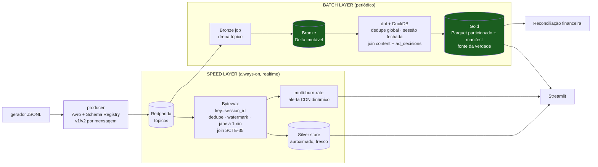

# DESIGN: Live Telemetry Platform

Este documento descreve a arquitetura de um slice vertical de plataforma de telemetria de audiência
para transmissões ao vivo. O cenário de referência é a final do Brasileirão 2026,
com pico de cerca de 8 milhões de espectadores simultâneos. O foco está no porquê de
cada escolha e nos trade-offs assumidos. O passo a passo de execução fica no `README.md`.

Uma convenção atravessa o texto. Onde um check ou métrica está declarado mas ainda não automatizado,
ele aparece marcado como `spec`. Onde roda no código entregue, aparece como `implementado`. O mesmo
eixo se reflete no campo `status:` de `OBSERVABILITY/slos.yaml`. A ideia é declarar o contrato-alvo
de qualidade sem fingir que tudo já está em produção.

---

## 1. O que está sendo construído

`live-telemetry-platform` é um template reutilizável, pensado para outras transmissões.
Essa lente de produto de plataforma, e não de solução de uso único, orienta as escolhas estruturais:
contratos versionados, observabilidade declarativa e fronteiras de responsabilidade explícitas, em
vez de atalhos que só funcionam para um dataset específico.

### O que está em escopo

- Contratos Avro versionados dos três streams principais, com Schema Registry e compatibilidade
  BACKWARD.
- Bronze imutável em Delta, Silver streaming em Bytewax e Gold batch em dbt com DuckDB.
- Dashboard em Streamlit com os gráficos principais, mais um corte de QoE por `network_type` que
  exercita a evolução de schema.
- Data quality checks nas quatro dimensões (freshness, volume, schema, distribution), com pelo menos
  um avaliado em runtime no streaming.
- Schema evolution ponta a ponta do campo `network_type`, sem quebrar consumidores antigos.
- Tratamento explícito das cinco anomalias presentes no dado de origem: duplicatas, eventos fora de
  ordem, clock skew, late data e o burst de degradação de CDN.

### O que ficou de fora, conscientemente

- **Infra distribuída real** (cluster Spark/Flink, Kafka multi-broker). Ferramentas nativas de
  streaming como o Apache Flink têm grande vantagem em performance, mas como o volume dos testes
  realizados era "pequeno" (entre 525 mil eventos com 2.000 sessões e 2,5 M com 10.000 sessões),
  cabe folgado em single-node.
  Para atender à escala de produção (cerca de 1 M ev/s), seria necessário um sistema muito mais
  robusto, então esse cenário é tratado de forma conceitual, não implementada.
- **Exactly-once end-to-end** com transações Kafka. Exactly-once é aplicado apenas onde paga: no Gold
  batch determinístico. O Silver é at-least-once com sink idempotente.
- **Skew correction ativa** por device. Em vez disso, a QoE é desenhada para ser skew-invariante e as
  janelas cross-device absorvem o skew. A correção ativa fica no roadmap.
- **Catálogo e lineage automatizados** (DataHub, OpenLineage). O lineage hoje vem do DAG do dbt.
- **Parte da observabilidade** permanece `spec`: alguns SLOs têm target acordado mas a automação do
  check ainda é roadmap. Esses não são contados como entregues.

---

## 2. O problema central: três consumidores, três SLAs incompatíveis

A mesma família de métricas (QoE, CCV) é exigida por três consumidores cujos requisitos puxam o
sistema em direções opostas:

| Consumidor | Necessidade | Latência | Exatidão |
|---|---|---|---|
| Diretoria comercial | CCV near real-time para vender patrocínio durante o jogo | p95 < 30 s | aproximada |
| Diretoria de produto | QoE por device, CDN e região para acionar mitigação ao vivo | near real-time | aproximada |
| Financeiro | Reconciliação auditável para faturamento de patrocínio | dia seguinte | exata e idempotente |

Comercial e produto querem o número agora e toleram aproximação. O financeiro quer o número certo e
tolera esperar até o dia seguinte, porque ali cada centavo conta. É o problema dos dois relógios:
latência mínima e exatidão auditável não cabem na mesma camada sem comprometer uma delas. Essa
tensão, e não uma preferência estética, é o que define a topologia do sistema.

---

## 3. Topologia: Lambda (batch como verdade, speed como aproximação)

A arquitetura utilizada foi a topologia **Lambda**. A camada **batch** (Bronze para Gold, em dbt com DuckDB)
é a fonte da verdade. A camada **speed** (Silver, em Bytewax) é uma aproximação dos dados que existe para cobrir
a latência do batch e entregar dados e informação para tomada de decisão em realtime. Cada consumidor é servido
pela camada que casa com o seu SLA.

Uma alternativa seria a arquitetura **Kappa**, apenas streaming, tratando o batch como um replay do
stream. O Kappa eliminaria a lógica duplicada, mas obriga o motor de streaming a produzir um resultado
exato, auditável e idempotente. Garantir isso no stream é mais custoso e complexo, e a fragilidade
recai justamente sobre o caso financeiro, que é o que tem menos tolerância a erro.

O custo aceito ao escolher Lambda é claro e é o que condiciona várias decisões adiante: a **lógica de
métrica fica duplicada**, uma vez em Python (Bytewax) e outra em SQL (dbt). Duas implementações da
mesma fórmula podem divergir por bug. A mitigação tem três frentes. As fórmulas ficam centralizadas
em `common/metrics.py` no Silver, o SQL do Gold as espelha, e ambas são testadas contra a mesma
fixture. Mais adiante, a própria divergência entre Silver e Gold vira um data quality check
(`silver_gold_divergence`), de modo que o único custo real da topologia passa a ser monitorável.

Vale separar dois tipos de divergência. A divergência **semântica** entre as camadas é esperada e
documentada: o Silver enxerga menos dado e fecha sessões por aproximação, então não bate com o Gold
ao centavo. Isso é uma propriedade do Lambda, não um defeito. Só vira alarme acima de um limiar, e aí
deixa de ser semântica para denunciar um bug na fórmula duplicada. A reconciliação é assimétrica e
simples: o Gold supersede o período fechado, e o Silver é descartado, não corrigido. É isso que
mantém a verdade contábil livre de qualquer aproximação herdada do stream.

---

## 4. Visão de arquitetura



Um gerador determinístico (seed fixa) produz JSONL, e o producer publica em Avro no Redpanda, registrando 
os contratos no Schema Registry e alternando v1 e v2 por mensagem para exercitar a coexistência de versões.
A partir do tópico, dois caminhos consomem o mesmo dado com offsets independentes, então uma camada nunca 
espera ou trava a outra. O caminho speed é o Silver em Bytewax, que sessiona, calcula QoE e CCV em janelas
de 1 minuto e mantém o alerta de CDN. O caminho batch drena o tópico para o Bronze imutável em Delta, de onde 
o dbt reconstrói o Gold.

O broker é a fronteira de contrato única dos streams de telemetria: nada bypassa o Redpanda para
chegar ao Bronze. O Bronze guarda o dado cru, com duplicatas, eventos fora de ordem e payloads v1 e
v2 convivendo sem limpeza, porque é a camada replayável de onde o Gold reconstrói a verdade quantas
vezes for preciso. Há uma única exceção ao caminho pelo broker: `ad_decisions` é um feed batch
externo do ad server, sem contrato no fio, e entra direto no Gold. É um dado de faturamento que nasce
reconciliado, não um stream de telemetria.

---

## 5. Broker: Redpanda

O sistema precisa de um broker com API Kafka para suportar replay, at-least-once e recovery de
broker-down reais, sem peso operacional num ambiente local single-node. Precisa também de um
Schema Registry para os contratos Avro. A escolha foi **Redpanda** em container único, com API Kafka
e sem ZooKeeper, Schema Registry embutido e o Redpanda Console para inspeção.

Duas alternativas foram descartadas. Uma **simulação em memória** eliminaria a dependência, mas não
exercitaria a semântica real de exactly-once, at-least-once, replay e recovery (offsets, retenção,
commit de offset), que é exatamente o comportamento que precisa ser validado contra um broker de
verdade. **Kafka com ZooKeeper** traria peso operacional (dois ou mais componentes, JVM)
injustificado num ambiente local.

As consequências importam para o resto do sistema. Replay e recovery são reais, com offsets e
retenção, não simulados, o que torna o procedimento de incidente de broker-down algo de fato
exercitável. O Console decodifica Avro via Registry, então não se perde a debuggabilidade do fio. Os
tópicos são efêmeros de propósito, sem volume: o broker reinicia limpo, e o producer re-registra os
contratos e republica. O estado que persiste é o do lake (Bronze, Silver e Gold) em `./data`.

---

## 6. Contratos: Avro com Schema Registry e compatibilidade BACKWARD

A plataforma precisa evoluir o schema ponta a ponta sem quebrar quem já consome: um campo novo
(`network_type`) tem que evoluir do contrato para o streaming, daí para o Gold e até o dashboard,
enquanto consumidores antigos continuam lendo o dado antigo e o novo. Isso pede um mecanismo de
compatibilidade que faça **default-fill na leitura**, não apenas validação. A decisão foi **Avro** nos
três streams principais, com **Schema Registry** (do Redpanda), um subject por TopicName e política de
compatibilidade **BACKWARD**.

A verdade da versão é o schema-id no fio, no wire-format Confluent, e não o campo in-band
`schema_version`, que é mantido apenas para debug, como uma redundância consciente. O feed
`ad_decisions` não tem contrato versionado, porque é um feed batch externo do ad server que
entra direto no Gold.

A alternativa era o **JSON Schema** teria menos atrito, mas valida sem fazer reader/writer resolution com
default-fill, o que enfraqueceria a evolução de schema na leitura.

O resultado é coexistência nas duas direções, coberta por testes em `tests/test_contracts.py`. Um
reader v2 lê dado v1 preenchendo `network_type = "unknown"` por default, e um reader v1 ignora o campo
extra de v2. Um campo novo declarado **sem** `default` é rejeitado no registro (`is_compatible:
false`), o que funciona como gate de drift de schema e é a base do procedimento de incidente de drift
em produção.

---

## 7. Lake: Bronze em Delta, Gold em Parquet com manifesto

O Bronze é a camada crua e replayável. O Gold é a verdade reconciliada que alimenta o faturamento.
Os dois precisam de overwrite atômico, para permitir rebuild determinístico, e de uma prova concreta 
de idempotência.

O **Bronze fica em Delta** (via delta-rs, sem Spark), o que dá transaction log, time-travel e
overwrite atômico sobre a fonte replayável. O **Gold é materializado em Parquet** pelo dbt,
particionado por `window_hour`, acompanhado de uma tabela-manifesto `_gold_runs.jsonl` que registra
`run_id`, `bronze_version`, `row_count` e o **checksum** das métricas-chave. A auditoria e a versão do
Gold vêm desse manifesto determinístico, não do formato de arquivo.

As alternativas rejeitadas explicam por que cada camada usa o que usa. **Parquet puro no Bronze**
ficaria sem overwrite atômico nem log de transação, e acabaria reimplementando o Delta pior do que
ele já faz, e o Bronze é exatamente onde o contrato de auditoria importa. **Iceberg local** é o alvo
de produção (catálogo engine-agnóstico, partition evolution). **Gold também em Delta** traria atrito 
entre dbt-duckdb e Delta sem ganho real, e Parquet com manifesto já cobre a auditoria.

A idempotência é comprovável, não apenas afirmada. A cada run o DuckDB é recriado do zero a partir do
Bronze determinístico, e o checksum sai igual em dois runs consecutivos. A justificativa do Delta é
por requisito de auditoria, não por volume: a cerca de 525 mil eventos qualquer formato rodaria, e o
Delta está presente pelo contrato de auditoria, que vale em qualquer escala. A ponte de Delta para
DuckDB é feita em Python (biblioteca `deltalake`), o que evita instalar a extensão Delta do DuckDB em
runtime e mantém o ambiente offline-friendly.

---

## 8. Speed layer: Bytewax, event-time e idempotência

A camada speed precisa sessionizar `player_events` por `session_id`, calcular QoE e CCV em janelas de
1 minuto em **event-time**, e lidar com out-of-order (15 s), clock skew (±5 s), duplicatas (cerca de 1
%) e recuperação de broker-down. O time é Python-native, e o Gold já é dbt com DuckDB, então não há um
caso batch que justifique trazer JVM para o sistema.

A decisão foi um **serviço Python sempre ligado em Bytewax**, com **at-least-once e sink idempotente**
em vez de exactly-once. Janelas de sessão e tumbling são nativas em event-time (via `EventClock`), o
recovery vem de snapshot, e a garantia de não-duplicação fica do lado do sink, pela chave natural
`(session_id, window_start)`.

As alternativas foram descartadas pelo mesmo raciocínio de não trazer JVM sem payoff. **Spark
Structured Streaming** teria como vantagem o reuso de código entre batch e streaming, mas essa vantagem
some porque o Gold é dbt com DuckDB. **Flink** tem o poder máximo (estado em RocksDB, exactly-once
nativo), mas JVM mais a DataStream API são inviáveis para executar no tempo, seria a escolha ideal
para engine de produção.

A consequência central é que o exactly-once de sink é resolvido por idempotência por chave natural, e
não por transações. O recovery re-emite janelas, e o sink absorve sem duplicar. O estado vive em
memória, o que faz dele o gargalo dominante em escala (detalhado adiante em custo). Na execução local
roda em single-worker (`run_main`), enquanto produção usaria `bytewax.run` multi-worker com
`RecoveryConfig`.

O restante desta seção detalha como cada anomalia do dado de origem é tolerada sem que o speed layer
pare ou minta de forma grosseira.

### O relógio

O event-time é o `timestamp` do device, que chega enviesado em ±5 s, mas de forma consistente dentro
de cada device. A QoE é desenhada para ser **skew-invariante**: durações intra-sessão (rebuffering,
watch time) são diferenças entre timestamps do mesmo device, então o offset se cancela. As métricas
cross-device (CCV por minuto, join com SCTE-35) não trocam de relógio e absorvem o skew na própria
largura da janela. Em paralelo, o Bronze carimba `ingestion_time`, que serve de âncora de freshness e
de estimativa de skew.

### Watermark e late data

```
W = max_event_time_visto − watermark_delay
watermark_delay ≈ 25 s    (out-of-order 15 s + clock skew 5 s + margem)
allowed_lateness ≈ 60 s   (grace para straggler leve; re-emite a janela)
além de allowed_lateness → side output (late_dropped, logado) → o Gold reconcilia
```

A decisão-chave aqui é o que o Silver escolhe **não** resolver. Um evento que chega 30 minutos
atrasado, por exemplo num replay depois que o broker volta, não é problema do speed layer. Ele cai no
side output `late_dropped`, e quem fecha a conta é o Gold, que enxerga o Bronze completo. O Silver é
aproximado por design, e tentá-lo tornar exato recriaria o problema que a topologia resolve.

Há um cuidado operacional sutil. Como o watermark global é o `min` sobre as chaves ativas, uma sessão
ociosa trava o avanço do watermark. A mitigação é um idle-timeout por chave, que fecha a sessão por
gap e libera o estado.

### Duas fontes de duplicata, dois mecanismos

A distinção mais importante do Silver é que existem dois tipos diferentes de duplicata, resolvidos por
mecanismos diferentes:

| Origem da duplicata | Mecanismo |
|---|---|
| Broker at-least-once (cerca de 1 % no fio) | dedupe set por `event_id`, por sessão, limitado por event-time (evict em `W − horizon`) |
| Recovery do Bytewax (re-emite janelas a partir do último snapshot) | idempotência no sink pela chave natural `(session_id, window_start)` |
| Re-emit por late data (allowed_lateness atualiza a janela) | mesma idempotência de sink |

O dedupe set filtra re-entrada, ou seja, o mesmo evento aparecendo duas vezes no fio. A idempotência
de sink absorve re-saída, ou seja, a mesma janela recalculada após um recovery. São coisas distintas,
separadas de propósito. O dedupe do Silver é best-effort e limitado por um horizonte de event-time. O
dedupe global e definitivo, sem horizonte, é responsabilidade do Gold.

### Sink append-only e compaction fora do hot path

A escolha de sink evoluiu durante a entrega, e a versão final é instrutiva. A primeira implementação
fazia um MERGE Delta da tabela inteira a cada micro-batch. Funciona em teoria, mas o MERGE relê o
`_delta_log` a cada commit, e o log cresce a cada commit, então o custo por commit vira O(n²). Na
prática, com 10 mil sessões o Silver acumulava milhares de merges e travava a partir de uns 30 minutos
de evento. Particionar mais fino ajudou pouco, porque o gargalo era o commit, não o scan.

A solução final é um sink **append-only** (`DeltaAppendSink`): cada batch é um append O(1), sem
read-modify-write. Isso reintroduz a possibilidade de duplicata por recovery, que é resolvida com
**dedup na leitura**. A view `silver_qoe` em `serving/data.py` aplica
`row_number() OVER (PARTITION BY session_id, window_start ORDER BY processed_at DESC)` e mantém só a
linha mais recente. A idempotência lógica é a mesma de antes, mas o custo de escrita saiu do hot path,
e o Silver passou a acompanhar o producer em tempo real mesmo no cenário de 10 mil sessões.

O append tem uma consequência conhecida: gera um arquivo por batch, o que vira milhares de small
files, e a leitura do dashboard varre todos eles. A resposta é compaction manual fora do hot path
(`make compact`, em `silver/compact.py`), que roda `optimize.compact()` e `vacuum()` sobre as tabelas
do Silver, reduzindo milhares de arquivos a algumas dezenas e a latência de leitura de segundos para
dezenas de milissegundos. A compaction é uma transação Delta ACID, então roda com o Silver no ar e é
idempotente. A decisão explícita é que ela não roda inline no stream, porque manter o hot path barato
é o ponto da arquitetura append-only.

### Sinais emitidos em runtime

Dois sinais são emitidos de verdade hoje: o alerta multi-burn-rate (descrito a seguir, contínuo) e o
`late_dropped` (log estruturado sobre o side output da janela). Outros sinais cujo mecanismo existe
mas cuja emissão como métrica ainda é roadmap (`dedupe_dropped_count`, `watermark_lag`,
`out_of_order_max`) são marcados `spec` e não contados como entregues.

Um detalhe de robustez aprendido na entrega: o sink Delta infere o schema do primeiro batch. Se uma
coluna chega inteira `None` (por exemplo, a primeira janela fecha antes do primeiro marker SCTE, então
`marker_id`, `break_type` e `scte_event_id` vêm todos nulos), o pyarrow infere tipo `null` e o Delta
rejeita com `SchemaMismatchError`. Resolvido com `_coerce_null_columns` mais `schema_hints` no sink,
com regressão em `tests/test_sink.py`.

---

## 9. Detecção de degradação de CDN: multi-burn-rate

O objetivo é detectar quando uma CDN degrada, e o critério de qualidade é que o detector seja
**dinâmico**: deve disparar para qualquer CDN que cruze o limiar, não para uma CDN conhecida de
antemão. Hardcodar `cdn-b` (a CDN que degrada nesta seed) seria frágil: quebraria assim que outra CDN
degradasse, assim que a topologia de CDNs mudasse ou assim que o dado de produção chegasse com nomes
diferentes. Aqui `cdn-b` dispara porque seus dados cruzam o critério, não porque o código sabe que ela
existe.

A mecânica é a de SLO, error budget e burn rate, emprestada do SRE do Google. O detector reusa o SLO
`slo_rebuffering_cdn` como budget, em vez de inventar um threshold próprio:

```
burn_rate = fração_ruim_observada / error_budget
```

Como o burn rate é normalizado pelo budget, um único threshold vale para qualquer CDN,
independentemente do seu volume. A fração-ruim consumida hoje é o `rebuffering_ratio`
(`rebuffer_ms / (rebuffer_ms + watch_ms)`), e não o error_rate, porque a degradação observada é
primariamente de buffering. No burst (minutos 60 a 75) o rebuffering sobe para cerca de 8 % contra um
SLO de 1 %, o que dá burn próximo de 8, enquanto os erros por minuto são modestos (cerca de 2×, já que
erro é terminal e esparso). O `error_rate` fica como sinal alternativo, computado em
`metrics.finalize` mas ainda não gateado.

A avaliação combina duas dimensões:

| Tier | Janela longa | Janela curta | Burn rate | Severidade |
|---|---|---|---|---|
| Fast | 5 min | 1 min | ≥ 4 | page |
| Slow | 30 min | 5 min | ≥ 2 | ticket |

O multi-window com AND (janela longa para significância estatística, janela curta para confirmar que
ainda está acontecendo) garante detecção rápida e também auto-resolução rápida na recuperação. O
multi-tier separa o que acorda o on-call (page) do que abre ticket. Os números espelham o
`BurnRateConfig` em `silver/alerting.py` e são calibrados à severidade desta seed. Em produção
derivariam do SLO mais a latência de detecção desejada.

Dois ajustes evitam falso positivo e flapping. Um gate de amostra mínima (`n_min = 50`) impede que uma
CDN de baixíssimo tráfego dispare por ruído. A histerese (acende após 2 avaliações, apaga após 3)
evita alerta piscando na borda. Tudo roda no Silver em event-time, o que faz desse detector o data
quality check avaliado em tempo real sobre o stream. O dashboard apenas lê o conjunto de CDNs em
alerta e destaca quem estiver lá, então ele também não conhece `cdn-b`.

---

## 10. Transformação Gold: dbt com DuckDB

O Gold recomputa as métricas a partir do Bronze com regras estritas: dedupe global, sessão fechada e
join de `content_metadata` com `ad_decisions`. Precisa ser idempotente. Além da transformação, a
camada precisa entregar visão de plataforma: lineage, qualidade, documentação e um template
reutilizável por outras squads.

A decisão foi fazer o Gold em **dbt-duckdb**, organizado em staging e marts, com `tests`, `sources`
com freshness e docs com lineage. O DuckDB é o motor de execução local, e o dbt é a camada de
transformação e governança.

A alternativa óbvia seria **DuckDB SQL puro em scripts**, que faria a mesma transformação com menos
atrito. O problema é que ela reimplementa lineage, data quality e docs na mão, e perde o sinal de
plataforma. O ponto não é a query em si, são os artefatos transversais ao redor dela.

O ganho é que esses artefatos saem quase de graça. O `dbt test` já cobre parte dos data quality
checks (`not_null`, `unique`, `accepted_values`), o DAG é o lineage, os docs são a comunicação, e o
`--full-refresh` determinístico dá a idempotência. Um único tool cobre lineage, parte da data
quality, docs e idempotência de uma vez, e vira um template reutilizável por outras squads. O custo a
vigiar é que joins complexos (a reconciliação de `ad_decisions` por `event_id_scte` mais overlap
temporal) podem vazar para macros ou Python se crescerem. Hoje cabem em SQL, em `gold_ad_impact.sql`.

O Gold entrega quatro marts: `gold_session_window_qoe` (QoE por sessão e janela, com dimensões de
content e `network_type` e a flag `session_complete`), `gold_ccv` (espectadores simultâneos),
`gold_ad_impact` (impacto comercial por marker SCTE-35) e `gold_ad_creatives` (anunciante e criativo
que rodaram em cada break).

---

## 11. Serving: Streamlit sobre DuckDB

O dashboard precisa de quatro visualizações centrais: CCV por região, rebuffering rolling por CDN,
alerta visual quando uma CDN degrada e tabela de impacto comercial por marker SCTE-35. O objetivo é
**comunicar**, não expor uma API programática.

A decisão foi **Streamlit** lendo o Gold (Parquet) e o Silver store com os alertas (Delta) via DuckDB.
A camada de queries é pura e testável (`serving/data.py`), separada do render (`serving/app.py`).

As alternativas pesavam mais código sem ganho para uma camada de visualização. **FastAPI** seria a
escolha se o objetivo fosse expor as métricas como produto, que é o alvo de produção, mas é mais código 
para o mesmo resultado visual. **Grafana sobre ClickHouse** seria uma stack de serving pesada 
e injustificada no ambiente local.

O resultado entrega as quatro visualizações mais um quinto painel de QoE por `network_type`, que
mostra a evolução de schema entregando valor analítico, tudo com menos código e iteração rápida. A
separação entre data e render deixa as queries testáveis headless, cobertas sem subir o Streamlit, e o
AppTest valida o app sem exceções. Os painéis degradam graciosamente quando falta dado (Gold antigo,
Silver não subiu): mostram aviso em vez de quebrar.

O dashboard reflete o medallion em duas abas. A aba **Silver (speed)** se auto-atualiza a cada 5
segundos, lendo Delta fresco. A aba **Gold (batch)** fica em cache.

---

## 12. Divergência Silver ↔ Gold e reconciliação

Silver e Gold divergem de propósito, como já antecipado na discussão da topologia. As causas são todas
rastreáveis às anomalias do dado de origem:

| Causa | Silver (speed) | Gold (batch) |
|---|---|---|
| late além de allowed_lateness | descarta, subconta | enxerga tudo no Bronze, completo |
| escopo de dedupe | in-state, limitado por horizonte | global no período |
| out-of-order além do watermark | side output | reordena tudo |
| recovery | at-least-once | determinístico |
| fechamento de sessão | timeout/gap (aproximado) | fronteira do período (exato, flag `session_complete`) |

A reconciliação é assimétrica: o Gold supersede o período fechado, e o Silver é descartado, não
reprocessado nem corrigido. Isso mantém a verdade contábil livre de qualquer aproximação.

A jogada de observabilidade fecha o ciclo. A divergência relativa entre Silver e Gold para a mesma
chave (`cdn × janela`) vira um data quality check, o `silver_gold_divergence`, hoje `spec`. Enquanto
fica abaixo de um limiar, é a divergência semântica esperada. Acima dele, deixa de ser semântica e
denuncia um bug na fórmula duplicada, que é precisamente o custo da topologia Lambda, agora
monitorável.

---

## 13. Observabilidade e SLOs

O catálogo completo está em `OBSERVABILITY/README.md` e os targets em `OBSERVABILITY/slos.yaml`, cada
item com `status: implemented | spec`. A plataforma cobre data quality nas quatro dimensões
(freshness, volume, schema, distribution), com pelo menos um check avaliado em tempo real sobre o
stream, porque uma falha de qualidade durante o jogo precisa ser detectada enquanto ainda dá para
agir.

Implementados, rodando na entrega:

| Check | Dimensão | Onde | Prova |
|---|---|---|---|
| `multi_burn_rate_cdn` | distribution | runtime (Silver) | `silver/alerting.py` → `cdn_alerts` |
| `late_dropped` | freshness | runtime (Silver) | `silver/dataflow.py` (log estruturado) |
| `registry_incompatible_reject` | schema | gate de contrato | `contracts/registry.py` (`set_backward`) |
| dbt `not_null` / `unique` | quality | pós-batch | `schema.yml` (`window_key`, `session_id`, `rebuffering_ratio`, `session_complete`, `ccv`, `event_id_scte`, `advertiser_name`, `creative_id`) |
| dbt `accepted_values` | schema | pós-batch | `break_type ∈ {commercial, blackout}` |

Em runtime há dois sinais sobre o stream: o `multi_burn_rate_cdn` avalia continuamente, e o
`late_dropped` registra o que passou do horizonte de lateness. No batch, são 12 dbt tests sobre os
quatro marts Gold (10 `not_null`, 1 `unique`, 1 `accepted_values`).

Permanecem `spec`, ou seja, com target escrito mas automação pendente: `silver_watermark_lag`,
`ingestion_lag`, `gold_freshness`, `event_count_vs_baseline`, `dedupe_dropped_ratio`,
`schema_v2_share`, `slo_error_rate_cdn` e `silver_gold_divergence`. Cada um tem o plano de
implementação registrado no catálogo, e nenhum é apresentado como rodando.

---

## 14. Requisitos não-funcionais

| NFR | Abordagem |
|---|---|
| **Reprodutibilidade** | `docker compose up` e `make demo`; `env.example`; nada instalado no host além de Docker |
| **Idempotência** | Bronze imutável determinístico (seed) mais Gold `--full-refresh` determinístico com overwrite e manifesto, gerando rebuild idêntico a menos dos timestamps de execução. O checksum em `_gold_runs.jsonl` comprova: igual em dois runs |
| **Exactly-once vs at-least-once** | EO apenas no Gold (batch determinístico); Silver at-least-once com sink idempotente |
| **Late-arriving data** | watermark 25 s, allowed_lateness 60 s e side output `late_dropped`; o Gold reconcilia |
| **Custo a 24/7** | ver abaixo |
| **LGPD** | ver abaixo |
| **Recuperação (broker 30 min)** | ver abaixo |

### Custo: o gargalo dominante em escala

1. **O estado do Silver é o gargalo dominante.** Session windows e dedupe sets crescem com o número de
   sessões concorrentes (8 M de CCV viram milhões de chaves vivas). O custo é memória e estado, mais o
   snapshot de recovery, não a CPU de transformação. As alavancas são TTL e idle-timeout agressivos,
   partição por `session_id` em N workers, e estado em RocksDB (Flink) em vez de memória.
2. O **shuffle do join temporal** (sessões × breaks SCTE) e o re-key por CDN do alerta vêm em seguida.
3. **Bronze e Gold são I/O-bound, não o gargalo de compute.** O custo deles é armazenamento e small
   files (muitas janelas de 1 minuto exigem compaction) e o scan do período no Gold, mitigado pela
   partição `window_hour`, já feita. O compute do Gold é barato e episódico, uma vez por dia.
4. O **broker** é custo de disco linear: retenção dimensionada para cobrir o pico mais folga de replay.

Em resumo, o estado de streaming é OPEX contínuo, enquanto o batch é storage mais um burst de compute.
O dial de custo mais sensível é o TTL de estado do Silver.

### LGPD

O `user_id` chega anonimizado na origem, e o ponto de pseudonimização fica no producer e na ingestão,
marcado no contrato. A chave de re-identificação viveria em KMS ou cofre separado em produção, nunca
no lake, e o lake só vê o pseudônimo. Por design, `ad_decisions.user_id_anon` é diferente de
`player_events.user_id`: são espaços de anonimização disjuntos, de sistemas distintos. Por isso a
reconciliação entre ad e audiência é feita por `event_id_scte` mais janela temporal, no nível do
break, e não por usuário. Privacidade e a realidade do ad server ficam alinhadas no mesmo desenho.

---

## 15. Limitações conhecidas

- Tudo foi demonstrado localmente (cerca de 525 mil a 2,5 milhões de eventos). As afirmações de escala 
  (arquivos pequenos, concorrência a 1 milhão de ev/s) seriam tratadas de maneira diferente caso o serviço 
  fosse atender a um cenário de produção.
- Parte da observabilidade é `spec`: SLOs declarados sem emissão automatizada. A cobertura de data
  quality vem dos checks implementados, e o restante é contrato-alvo.
- O `dedupe_horizon` é finito, então uma duplicata patológica muito tardia passa pelo Silver. O Gold a
  pega no dedupe global.
- Sem skew correction ativa, o CCV cross-device tem fuzz de ±5 s na borda do bucket.
- O multi-burn-rate tem cold start: as janelas longas só enchem com o tempo.

---

## 16. Evolução futura

Com mais tempo, a ordem de ataque seria:

1. **Exactly-once end-to-end** demonstrável, com transações Kafka e sink transacional.
2. **Iceberg** no lugar de Delta (catálogo engine-agnóstico, partition evolution), com migração
   documentada.
3. **Flink** como engine de produção para suportar cargas maiores.
4. **Skew correction** ativa por device (offset próximo de `median(ingestion − event)`).
5. **Automatizar os checks `spec`**: emitir `watermark_lag`, `dedupe_ratio` e `event_count` no Silver,
   `dbt source freshness`, e o `silver_gold_divergence` como `dbt test`, fechando o catálogo.
6. **Lineage automatizado** (OpenLineage, Marquez) e catálogo (DataHub).
7. **CI/CD**, bloqueando PRs com schema incompatível e movendo o gate BACKWARD do runtime para o pull request.
8. **API** Para expor as métricas como produto, transformando o pipeline em um serviço reutilizável para outras
    lives.
9. **Grafana e ClickHouse** para servir as métricas analíticas.

---

## 17. Estrutura do repositório

```
live-telemetry-platform/
├── README.md · DESIGN.md
├── docker-compose.yml · Makefile · env.example · pyproject.toml · requirements.txt
├── CONTRACTS/                # *.avsc (player v1/v2, scte35, content) + política de compat
├── OBSERVABILITY/            # README (catálogo de DQ) + slos.yaml (status implemented|spec)
├── src/live_telemetry/
│   ├── common/               # config, logging, métricas (fonte única das fórmulas)
│   ├── contracts/            # (de)serialização Avro + Schema Registry
│   ├── ingestion/            # producer JSONL → Redpanda (v1/v2 por mensagem)
│   ├── bronze/               # drain batch → Delta imutável
│   ├── silver/               # dataflow Bytewax (window, dedupe, alerta, sink append-only, compact)
│   ├── gold/                 # orquestrador + projeto dbt (staging → marts)
│   └── serving/              # app Streamlit (2 abas) + camada de queries (dedup-on-read)
└── tests/                    # contratos, bronze, silver, alerting, sink, schema-evolution, smoke e2e
```

---

## 18. Glossário de domínio

- **QoE** (Quality of Experience): rebuffering ratio, video startup time, exit-before-video-start,
  average bitrate e error rate.
- **CCV** (Concurrent Viewers): audiência simultânea.
- **SCTE-35**: sinalização de cue tones que marca quebras comerciais no transport stream.
- **SSAI** (Server-Side Ad Insertion): inserção dinâmica de anúncio do lado do servidor.
- **Live vs VOD**: ao vivo (event-time crítico, late data sensível) versus sob demanda.
- **Lambda**: topologia com camada batch (verdade) e camada speed (aproximação realtime), servindo
  consumidores de SLAs distintos a partir da mesma fonte.

## Uso de IA assistente

Este projeto foi construído com IA como parceira de implementação em todas as fases.
As decisões de arquitetura, os trade-offs, o escopo e o que ficou de fora foram minhas, 
feitas com base em pesquisas e discussões com a IA. Ela também foi usada para agilizar 
a escrita de código e a revisão dos textos de Documentação.